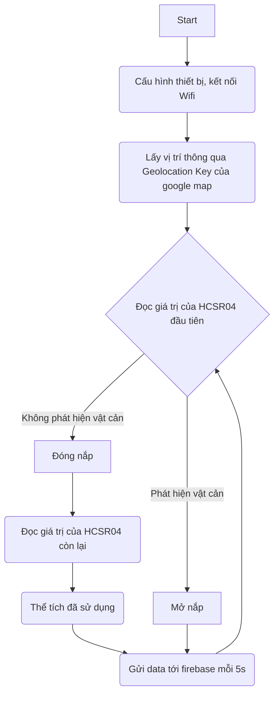

# Smart Bin Project
# Tổng quan

Sử dụng ESP32 để điều khiển thùng rác thông minh có chức năng tự đóng, mở nắp khi phát hiện người ở gần, gửi dữ liệu lên Firebase và hiển thị lên website của bạn

Code sử dụng Arduino và một số thư viện:ESP32Servo,Wifi,Firebase_ESP_Client có thể import trực tiếp từ arduino library và WifiLocation của https://github.com/gmag11/WifiLocation

Web sử dụng OpenStreetMap API để hiển thị vị trí và sử dụng firebase để host

# Flowchart

# Chi tiết hoạt động

Đầu tiên, cần thiết lập một số thông số trước khi sử dụng
https://github.com/dangvuhoang0402/smart_bin/blob/9494bd07a82257c34571821904bf416bf818f306/smartbin/smartbin.ino#L29-L31
https://github.com/dangvuhoang0402/smart_bin/blob/9494bd07a82257c34571821904bf416bf818f306/smartbin/smartbin.ino#L33-L34

Giá trị của googleApiKey sẽ là API Key trong tài khoản google map của bạn, ssid passwd lần lượt là tên và pass wifi mà esp32 sẽ kết nối

API_KEY và DATABASE_URL lần lượt là mã API và URL của database được firebase cung cấp

Sau khi thiết lập xong, ta có thể tiến hành chạy setup

Sau khi thực hiện xong setup, ta có thể sử dụng lệnh sau để lấy được vị trí
https://github.com/dangvuhoang0402/smart_bin/blob/9494bd07a82257c34571821904bf416bf818f306/smartbin/smartbin.ino#L102

Lúc này, biến loc của ta sẽ có 2 thuộc tính là lat và lon tương ứng với kinh độ và vĩ độ của vị trí

Ta có thể tiến hành gửi vị trí của ta lên firebase
https://github.com/dangvuhoang0402/smart_bin/blob/9494bd07a82257c34571821904bf416bf818f306/smartbin/smartbin.ino#L153
https://github.com/dangvuhoang0402/smart_bin/blob/9494bd07a82257c34571821904bf416bf818f306/smartbin/smartbin.ino#L160

Ở đây ta thực hiện ép kiểu thành string rồi mới gửi lên firebase

Đối với các hoạt động cơ bản như điều khiển servo, đọc giá trị hcsr04, kết nối wifi, ta vẫn thực hiện như bình thường rồi gửi dữ liệu mong muốn lên firebase

