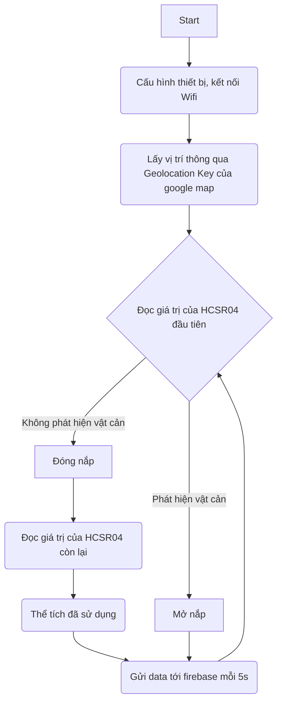

# Smart Bin Project
# Tổng quan

Sử dụng ESP32 để điều khiển thùng rác thông minh có chức năng tự đóng, mở nắp khi phát hiện người ở gần, gửi dữ liệu lên Firebase và hiển thị lên website của bạn

Code sử dụng Arduino và một số thư viện:ESP32Servo,Wifi,Firebase_ESP_Client có thể import trực tiếp từ arduino library và WifiLocation của https://github.com/gmag11/WifiLocation

Web sử dụng OpenStreetMap API để hiển thị vị trí và sử dụng firebase để host

# Flowchart

# Chi tiết hoạt động (Phần ESP32)

Đầu tiên, cần thiết lập một số thông số trước khi sử dụng
https://github.com/dangvuhoang0402/smart_bin/blob/9494bd07a82257c34571821904bf416bf818f306/smartbin/smartbin.ino#L29-L31
https://github.com/dangvuhoang0402/smart_bin/blob/9494bd07a82257c34571821904bf416bf818f306/smartbin/smartbin.ino#L33-L34

Giá trị của googleApiKey sẽ là API Key trong tài khoản google map của bạn, ssid passwd lần lượt là tên và pass wifi mà esp32 sẽ kết nối

API_KEY và DATABASE_URL lần lượt là mã API và URL của database được firebase cung cấp

Sau khi thiết lập xong, ta có thể tiến hành chạy setup

Sau khi thực hiện xong setup, ta có thể sử dụng lệnh sau để lấy được vị trí
https://github.com/dangvuhoang0402/smart_bin/blob/9494bd07a82257c34571821904bf416bf818f306/smartbin/smartbin.ino#L102

Lúc này, biến loc của ta sẽ có 2 thuộc tính là lat và lon tương ứng với kinh độ và vĩ độ của vị trí

Ta có thể tiến hành gửi vị trí của ta lên firebase
https://github.com/dangvuhoang0402/smart_bin/blob/9494bd07a82257c34571821904bf416bf818f306/smartbin/smartbin.ino#L153
https://github.com/dangvuhoang0402/smart_bin/blob/9494bd07a82257c34571821904bf416bf818f306/smartbin/smartbin.ino#L160

Ở đây ta thực hiện ép kiểu thành string rồi mới gửi lên firebase

Giá trị của HCSR04 được lưu lần lượt vào 2 biến
https://github.com/dangvuhoang0402/smart_bin/blob/9494bd07a82257c34571821904bf416bf818f306/smartbin/smartbin.ino#L113
https://github.com/dangvuhoang0402/smart_bin/blob/9494bd07a82257c34571821904bf416bf818f306/smartbin/smartbin.ino#L122

Trong đó, distanceCm_1 là giá trị mà HCSR04 đầu tiên đọc được ( HCSR04 đặt ở phía trước) còn distanceCm_2 là giá trị mà HCSR04 còn lại đọc được

Đối với các hoạt động cơ bản như điều khiển servo, kết nối wifi, so sánh giá trị của HCSR04 rồi tính toán, ta thực hiện như bình thường rồi gửi dữ liệu mong muốn lên firebase.

# Chi tiết hoạt động (Phần Web)

Với phần hiển thị OpenStreetMap lên website, ta có thể tham khảo https://sethphat.com/sp-848/su-dung-openstreetmap-api-cho-website-cua-ban-leafletjs

Sau khi đã tham khảo đường link trên, ta đã có thể add Marker tại vị trí mong muốn thông qua kinh độ và vĩ độ cụ thể.

Vậy lúc này, ta chỉ cần đọc dữ liệu từ firebase để lấy kinh độ và vĩ độ để hiển thị vị trí của smart bin thôi
https://github.com/dangvuhoang0402/smart_bin/blob/670302d6ca653d4896afa5c82c1afe6698849c46/smartbin/map.html#L45-L56
phần config thì ta có thể tham khảo
https://firebase.google.com/docs/web/setup

Tạo các biến để lưu giá trị hiển thị
https://github.com/dangvuhoang0402/smart_bin/blob/670302d6ca653d4896afa5c82c1afe6698849c46/smartbin/map.html#L58-L61

Rồi sau đó tiến hành lắng nghe thay đổi ở firebase, ví dụ như
https://github.com/dangvuhoang0402/smart_bin/blob/670302d6ca653d4896afa5c82c1afe6698849c46/smartbin/map.html#L110

Ở đây ta sử dụng lệnh databbase.ref(...).on("value",function(snapshot) tức là khi giá trị tại database đó thay đổi, hay cụ thể trong đoạn code là Latitude tại nhánh test, câu lệnh dưới sẽ được thực hiện

Tổng hợp lại ta sẽ đuọc đoạn code
https://github.com/dangvuhoang0402/smart_bin/blob/670302d6ca653d4896afa5c82c1afe6698849c46/smartbin/map.html#L110-L152

Mỗi khi kinh độ hoặc vĩ độ thay đổi, ta sẽ update lại marker
https://github.com/dangvuhoang0402/smart_bin/blob/670302d6ca653d4896afa5c82c1afe6698849c46/smartbin/map.html#L113
Còn khi State hoặc thể tích thay đổi, ta sẽ update lại content của marker ( ở đây code thiếu mất phần update khi thể tích thay đổi)
https://github.com/dangvuhoang0402/smart_bin/blob/670302d6ca653d4896afa5c82c1afe6698849c46/smartbin/map.html#L127-L149
